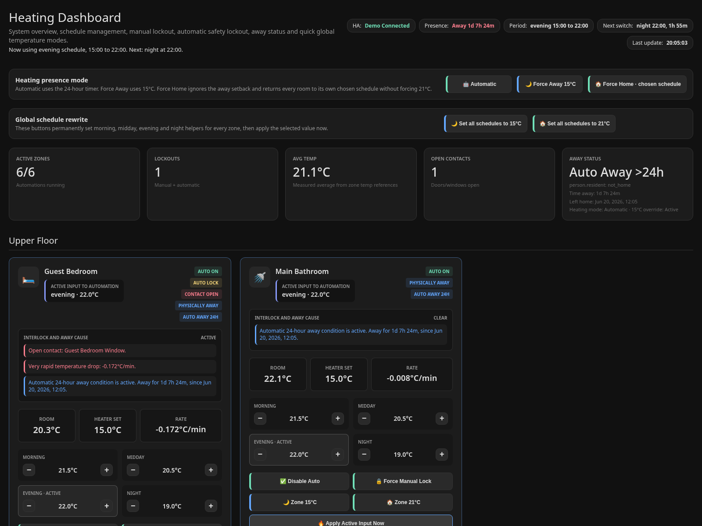
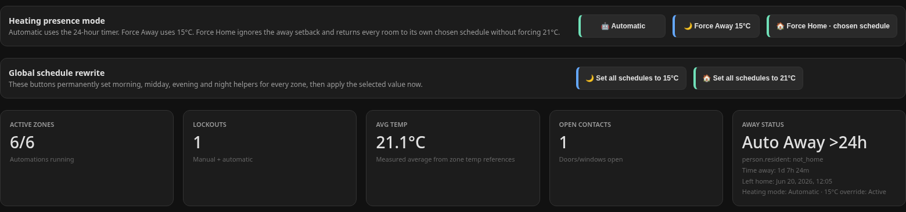
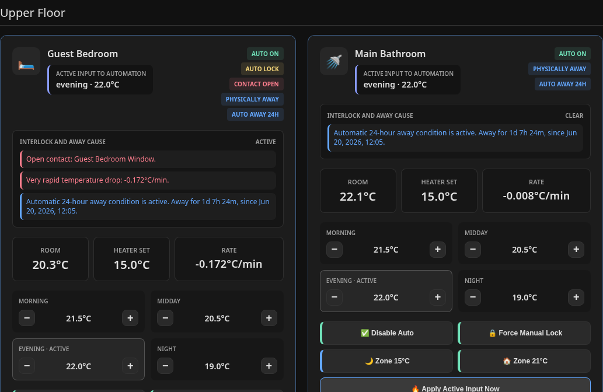
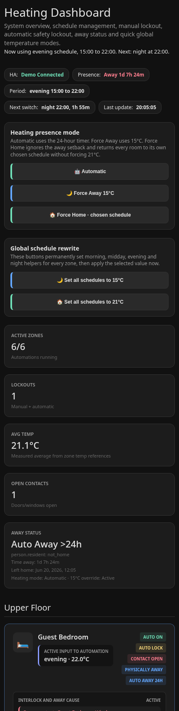

# Home Assistant Multi-Zone Heating

A reusable YAML framework and standalone dashboard for room-by-room heating schedules, presence-based setback, safety lockouts and thermostat correction.



## What it does

* Four scheduled targets per room: morning, midday, evening and night
* Optional averaging of several room-temperature sensors
* Automatic 15 °C setback after 24 hours away
* Three independent heating modes: `Automatic`, `Force Away`, and `Force Home`
* Window and door lockouts, manual lockouts, temperature-rate monitoring and thermostat limits
* A responsive HTML dashboard with status, setpoints, quick controls and interlock explanations

## Dashboard tour

### Whole-home status and presence controls



The header shows Home Assistant connectivity, physical presence, the active schedule period and the next period change. The three presence-mode buttons do not modify physical tracking:

* **Automatic** follows room schedules and applies the away setback only after the configured delay.
* **Force Away** activates the away temperature immediately.
* **Force Home** ignores the away setback and returns every zone to its chosen schedule. It does not force 21 °C or overwrite helper values.

The summary cards show active zones, lockouts, average measured temperature, open contacts and the exact elapsed time away.

### Zone cards and interlock explanations



Each zone card contains:

1. The active schedule helper and current target period
2. Automation, lockout, contact and away badges
3. A plain-language explanation of any interlock cause
4. Measured room temperature, current heater setpoint and temperature rate
5. Editable morning, midday, evening and night helpers
6. Zone-level automation, lockout and quick-temperature controls
7. Expandable entity details for troubleshooting

### Mobile layout



The layout collapses to one column on phones while retaining all controls and diagnostics. Long status text, entity IDs and buttons remain contained within their cards.

## What information you need

Open **Home Assistant → Developer Tools → States**. Copy exact entity IDs for:

* A `person.` or `device_tracker.` entity used for presence
* Every `climate.` heater or thermostat
* Room-temperature `sensor.` entities
* Optional `binary_sensor.` door and window contacts
* Four `input_number.` schedule helpers per room
* Manual and optional automatic lockout helpers
* Floor-temperature sensors for floor heating, if applicable

Fill in [`docs/ENTITY_WORKSHEET.md`](docs/ENTITY_WORKSHEET.md). Never guess entity IDs.

## Two adoption paths

### AI-assisted

1. Fill in the entity worksheet.
2. Attach the files in this repository to your AI assistant.
3. Use [`docs/AI_CUSTOMIZATION_PROMPT.md`](docs/AI_CUSTOMIZATION_PROMPT.md).
4. Review every generated entity ID before installing.

### Manual

Follow [`docs/MANUAL_CUSTOMIZATION.md`](docs/MANUAL_CUSTOMIZATION.md) and start from the closest example in `examples/`.

## Repository layout

```text
automations/   reusable presence automation
dashboard/     live dashboard and populated demo
docs/          worksheet, AI prompt, guides and screenshots
examples/      generic panel, floor and multi-heater zone templates
snippets/      only the shared heating helpers required by the project
```

## Important safety note

Heating equipment and frost protection can be safety-critical. Test thermostat limits, contact behavior, lockouts, restarts and all three presence modes before relying on the system unattended.

## Dashboard authentication

The dashboard stores a Home Assistant Long-Lived Access Token in browser local storage. Use it only on trusted devices and networks. Never commit a token to GitHub.

## Required schedule and lockout helpers

Every zone automation expects four schedule `input_number` helpers and two lockout `input_boolean` helpers. Version 1.1.2 includes complete generic examples and refreshed overflow-safe screenshots:

* `examples/input_numbers.example.yaml`
* `examples/input_booleans.example.yaml`

Copy and rename the helper group once per zone, then use those exact entity IDs in the automation and dashboard.
